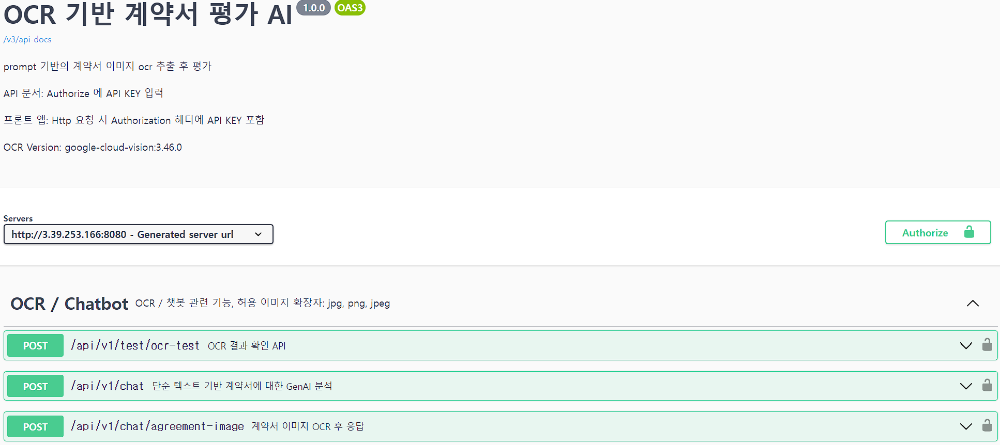
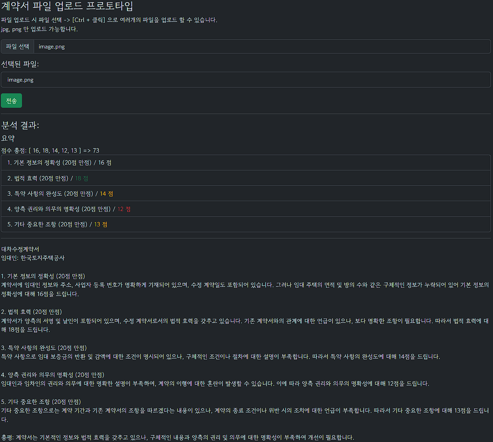
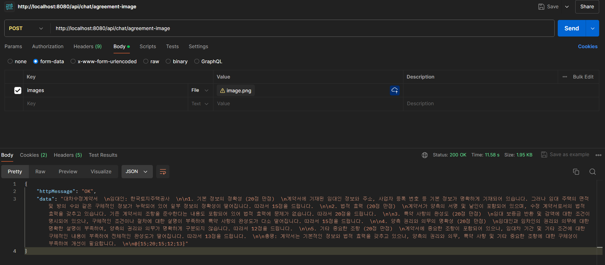

# GenAI 기반 계약서 인식·평가 서비스 / ART 해커톤 2팀

## 오픈소스 기반 OCR 라이브러리-Tesseract(tess4j) 이용

### 추후에 Google OCR 서비스 or Amazon Textract로 바꿀 수도 있음
#### API 문서 주소:
    http://3.39.253.166:8080/swagger-ui/index.html
#### 위 주소에서 API 테스트 가능 - 배포 완료 (2024-08-24)

### 테스트 사이트 내 출력 예시

---

* 기능
  * ⚙️ gen ai 기능은 프롬프트 기반, 현재는 추가 튜닝 X
    * 가능하다면 다른 튜닝 기술을 추가할 수도 있을듯
    * 응답 텍스트를 프롬프트로 일정하게 요청하긴 했으나, 이 부분은 수정이 필요함
    * 단순히 텍스트 기반으로 통째로 출력하는 것이 목적이라면 중요하진 않음
  * ⚙️ 현재 추가된 기능
    * 단순 text 기반 계약서 분석 응답: gpt-3.5 turbo
    * 여러장 계약서 이미지 업로드, OCR 추출 후 분석 응답: gpt-4o-mini
      * tessdata 기반 kor(한국어), osd(광학 문자 인식)
      * 오픈소스여서 한국어 인식률이 조금 부족한 경향을 보임
      * 중국어 번체(한자) 학습 데이터(chi_tra)를 추가하려고 했으나 한글로 쓰여진 한자어(e.g. 성명) 같은 것도 한문으로 번역하는 문제 발생, 따라서 중국어는 추가하지 않음

- 스트리밍 응답 추가 예정 (좀 오래 걸릴것으로 예상)

처리 로직 요약
<pre><code>
이미지 파일 업로드(한장 또는 여러장)
-> 
// ocr service 내에서 업로드한 이미지 여러장을 반복적으로 ocr 인식 후 text로 합쳐서 리턴
String convertedTxt = ocrService.doImagesOcr(List&lt;MultipartFile&gt; files);
->
// ocr 텍스트 계약서를 ai에게 판단 요청
String generatedMessage = Assistant.chat(convertedTxt);

</code></pre>

## 응답 테스트 예시
### POSTMAN

> 마지막에 @{1항 평가 점수;2항 평가 점수;3항 평가 점수;4항 평가 점수;5항 평가 점수} 으로 데이터 들어감
split('@')[1] 으로 {점수 리스트} 획득 가능

---
### 의존성
https://mvnrepository.com/artifact/net.sourceforge.tess4j/tess4j/5.13.0 tess4j(ocr)
https://mvnrepository.com/artifact/dev.langchain4j/langchain4j langchain4j
https://mvnrepository.com/artifact/dev.langchain4j/langchain4j-open-ai langchain4j-openai